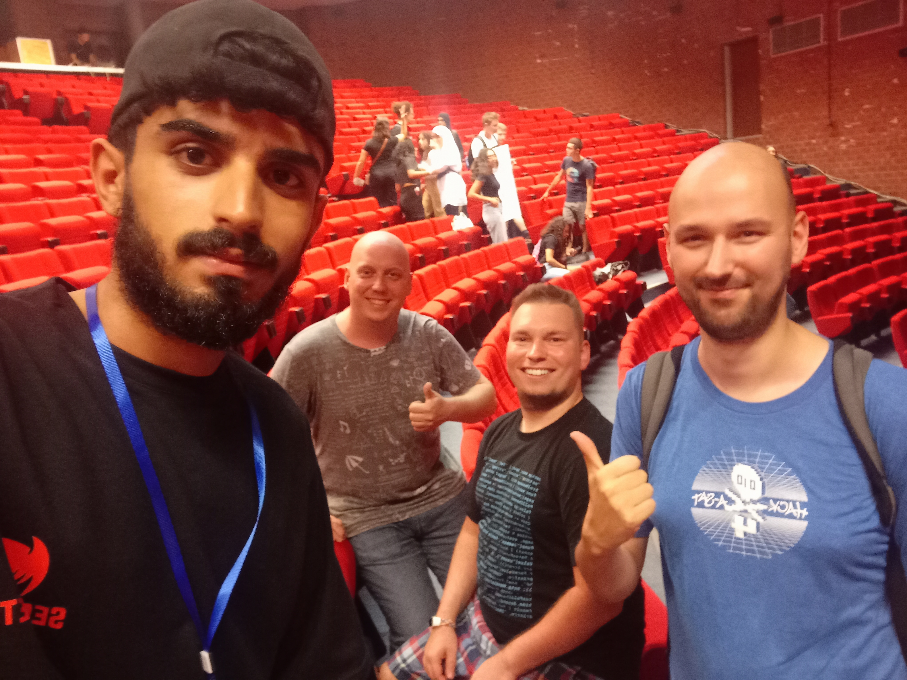

<link rel="stylesheet" href="https://cdnjs.cloudflare.com/ajax/libs/highlight.js/11.8.0/styles/monokai-sublime.min.css">

<link rel="icon" href="./favicon.ico" type="image/x-icon">

# Git & GitHub

#### + other things you should know

---



--

## Who am i ?

- MEN-see not mnsi 😭😭
- Founding President & Tech. Director SecuriNets
- CTF Player @Curiosity (1st Team Tunisia)
- CTF Player @0xL4ugh (1st Team Egypt)

---

## STORY BEFORE THE TECH. SIDE


--


--

#### 1. YOU cant speak about git without mentioning linux

#### 2. "git was my second big project which i made to handle my first big project" -linus-

#### 3. we use git technology for two reasons : version-control and collaboration.

#### 4. git became the world standard technology

#### 5. clash with bitkeeper (paid + fail point) was the reason git was born.

--

```text
LINUX KERNEL
Thousands of developers
        ↓
Need distributed version control
        ↓
       BitKeeper
        ↓
      2005
        ↓
BitKeeper situation breaks down
        ↓
     "Fine..."
        ↓
      BUILD GIT

```

---


--

We start with a tiny project.

```text
git-demo/
├── names.txt
└── languages.txt
```

`names.txt`

```text
Amine
Ahmed
Sara
```

`languages.txt`

```text
C
Python
JavaScript
```

--

### 1. Create the repository

```bash
cd git-demo
git init
```

> "This is just a normal folder."
>
> "`git init` turns it into a Git repository."

```bash
git status
```

> "Git, tell me what is happening."

--

### 2. Git sees our files

```bash
git status
```

```text
Untracked files:

    names.txt
    languages.txt
```

> "Git can see the files, but it isn't tracking them yet."

--

### 3. Stage the files

```bash
git add names.txt
git status
```

Now:

```text
names.txt       → staged
languages.txt   → untracked
```

> "I'm telling Git: I want this change in my next commit."

Then:

```bash
git add languages.txt
git status
```

Both files are now staged.

```text
WORKING DIRECTORY
        |
        | git add
        v
STAGING AREA
```

--

### 4. Create our first save point

```bash
git commit -m "Add students and languages"
```

Then:

```bash
git status
```

> **"We just created our first SAVE POINT."**

--

### 5. Look at the history

```bash
git log --oneline
```

```text
a82f1c3 Add students and languages
```

> "Git now remembers this exact version of our project."

--

### 6. Create a second version

Ahmed learns Rust.

Change `languages.txt`:

```text
C
Python
JavaScript
Rust
```

Then:

```bash
git status
```

Git tells us:

```text
modified: languages.txt
```

Before committing:

```bash
git diff
```

```diff
 C
 Python
 JavaScript
+Rust
```

> **"`git diff` shows me exactly what changed."**

--

### 7. Save the second version

```bash
git add languages.txt
git commit -m "Add Rust"
```

Now:

```bash
git log --oneline
```

```text
b31e8aa Add Rust
a82f1c3 Add students and languages
```

> "We now have TWO versions of the project."

```text
VERSION 1
   |
   v
COMMIT
   |
   v
VERSION 2
   |
   v
COMMIT
```

--

### 8. Now let's break something

Change `names.txt`:

```text
Amine
Ahmed
Sarra
```

Oops.

```bash
git diff
```

```diff
 Amine
 Ahmed
-Sara
+Sarra
```

> "I made a mistake."
>
> "I want the old version back."

--

### 9. Git saves us

```bash
git restore names.txt
```

Then:

```bash
cat names.txt
```

```text
Amine
Ahmed
Sara
```

And:

```bash
git status
```

> **"Git just saved us."**

--

### 10. Inspect the history

```bash
git show
```

> "I can inspect exactly what the latest commit changed."

You can also inspect a specific commit:

```bash
git show a82f1c3
```

--

### The story

```text
CREATE PROJECT
      |
      v
   git init
      |
      v
  git status
      |
      v
    git add
      |
      v
  git commit
      |
      v
  SAVE POINT
      |
      v
  CHANGE FILE
      |
      v
   git diff
      |
      v
  git commit
      |
      v
  MAKE A MISTAKE
      |
      v
  git restore
      |
      v
  WE'RE BACK
```

--

### The commands we just learned

```bash
git init
git status
git add
git commit
git log
git diff
git restore
git show
```

> **Don't memorize the commands yet.**
>
> **Understand the story:**
>
> **CHANGE → INSPECT → STAGE → COMMIT → REMEMBER → RECOVER**

--


---


--

### Demo 1 vs Demo 2 : alone vs collab


--

# MY FRESHER MISTAKE

> **“I thought `git clone`, `git push`, `git pull`, `git remote`...**
>
> **came from GitHub.”**

--

```text
          WRONG :))

       GitHub
          ↓
   "gave us Git commands"

```

```
          ACTUALLY...

           GIT
     ┌─────────────┐
     │ clone       │
     │ push        │
     │ pull        │
     │ remote      │
     └─────────────┘
             +
        Git server
```

---


--

## Git Gets a Teammate

We continue with the exact project from Demo 1.

```text
git-demo/
├── names.txt
└── languages.txt
```

At this point, our Git history exists **only on our computer**.

> **"Our project has memory... but there is a problem."**
>
> **"That memory is only on my computer."**
>
> **"What happens when Ahmed joins the project?"**

--

### 1. Create the GitHub repository

On GitHub, create an empty repository:

```text
git-demo
```

Don't add:

- README
- `.gitignore`
- License

Our project already exists locally.

GitHub gives us a URL:

```text
https://github.com/YOUR_USERNAME/git-demo.git
```

--

### 2. Connect Git to GitHub

Back in the terminal:

```bash
git remote add origin https://github.com/YOUR_USERNAME/git-demo.git
```

Check it:

```bash
git remote -v
```

You should see:

```text
origin  https://github.com/YOUR_USERNAME/git-demo.git (fetch)
origin  https://github.com/YOUR_USERNAME/git-demo.git (push)
```

> **"My local Git repository now knows where its remote repository lives."**

--

### 3. Use `main`

If your branch is still called `master`:

```bash
git branch -M main
```

Check:

```bash
git branch
```

```text
* main
```

> **"Let's use `main` as the main branch of our project."**

--

### 4. Push our project

Now the big moment:

```bash
git push -u origin main
```

Say:

> **"Our project was living on my laptop..."**
>
> **"Now let's send it to GitHub."**

```text
MY COMPUTER
     |
     | git push
     v
   GITHUB
```

Open GitHub.

Show:

```text
names.txt
languages.txt
```

and the commit history.

Then:

> **"GitHub didn't create the Git history."**
>
> **"We just uploaded our Git repository to GitHub."**

--

### 5. Ahmed joins the project

Ahmed has an empty computer.

He doesn't need to manually create the project.

He clones it:

```bash
git clone https://github.com/YOUR_USERNAME/git-demo.git
```

Then:

```bash
cd git-demo
```

Check the history:

```bash
git log --oneline
```

Ahmed gets the same history.

```text
GITHUB
   |
   | git clone
   v
AHMED'S COMPUTER
```

> **"`git clone` gives you a local Git repository connected to the remote repository."**

--

### 6. Ahmed makes a change

Ahmed opens:

```text
names.txt
```

and adds:

```text
Amine
Ahmed
Sara
Yasmine
```

Then:

```bash
git status
```

And:

```bash
git diff
```

Then:

```bash
git add names.txt
git commit -m "Add Yasmine"
```

Ahmed now has a new commit **locally**.

But GitHub doesn't know about it yet.

--

### 7. Ahmed pushes

```bash
git push
```

Now:

```text
AHMED'S COMPUTER
       |
       | git push
       v
     GITHUB
```

Open GitHub again.

The new commit is there.

> **"Ahmed changed the project and sent his commit to the shared repository."**

--

### 8. Amine is now outdated

Go back to your original project.

Run:

```bash
git status
```

Your local repository doesn't have Ahmed's commit yet.

Ask:

> **"How do I get Ahmed's work?"**

Then:

```bash
git pull
```

Now:

```text
GITHUB
   |
   | git pull
   v
MY COMPUTER
```

Check:

```bash
cat names.txt
```

You now see:

```text
Amine
Ahmed
Sara
Yasmine
```

> **"Now my local repository has Ahmed's changes."**

--

### 9. The important concept

```text
                 GITHUB
                /      \
           push ↑        ↓ pull
              /          \
             /            \
       AMINE                AHMED
       LOCAL                LOCAL
```

### `push`

> **"Send my commits to the remote."**

```bash
git push
```

### `pull`

> **"Get the latest changes from the remote."**

```bash
git pull
```

### `clone`

> **"Give me a local copy of the repository."**

```bash
git clone <URL>
```

--

### 10. Now introduce branches

> **"But there's a problem."**
>
> **"We don't want Ahmed directly modifying `main` all the time."**

Ahmed creates a branch:

```bash
git switch -c feature/add-language
```

Then modifies:

```text
languages.txt
```

For example:

```text
C
Python
JavaScript
Rust
Go
```

Commit:

```bash
git add languages.txt
git commit -m "Add Rust and Go"
```

Push the branch:

```bash
git push -u origin feature/add-language
```

Now GitHub has:

```text
main
feature/add-language
```

--

### 11. Pull Request

Open GitHub.

You should see an option like:

```text
Compare & pull request
```

The workflow:

```text
feature/add-language
          |
          v
    Pull Request
          |
          v
        Review
          |
          v
        Merge
          |
          v
         main
```

Say:

> **"Ahmed isn't saying: 'I changed main.'"**
>
> **"He's saying: 'I made a change. Please review it and decide whether it should become part of main.'"**

This is a **Pull Request**.

--

### The whole story

```text
              GIT + GITHUB

Local repository
      |
      | git remote add
      v
    GitHub
      |
      | git clone
      v
    Teammate
      |
      | edit
      v
    commit
      |
      | git push
      v
    GitHub
      |
      | git pull
      v
    You
```

Then:

```text
                 GitHub
                   |
          +--------+--------+
          |                 |
        main        feature/add-language
                            |
                            v
                       Pull Request
                            |
                            v
                          Review
                            |
                            v
                          Merge
                            |
                            v
                           main
```

--

### The commands we just learned

```bash
git clone <url>

git remote -v
git remote add origin <url>

git branch -M main

git push -u origin main
git push

git pull

git switch -c feature/name
git push -u origin feature/name
```

> **Demo 1:** Git gives me a memory.
>
> **Demo 2:** GitHub gives that repository a shared home.
>
> **`clone`** → join the project.
>
> **`push`** → share my work.
>
> **`pull`** → get everyone else's work.
>
> **branch + Pull Request** → collaborate without directly changing `main`.

---

# RANDOM ADVICES :))))

---

# Your GitHub Is Your Identity

---

# Collaborate & Unlock Achievements

---

# I got a job from github

---

# ...
