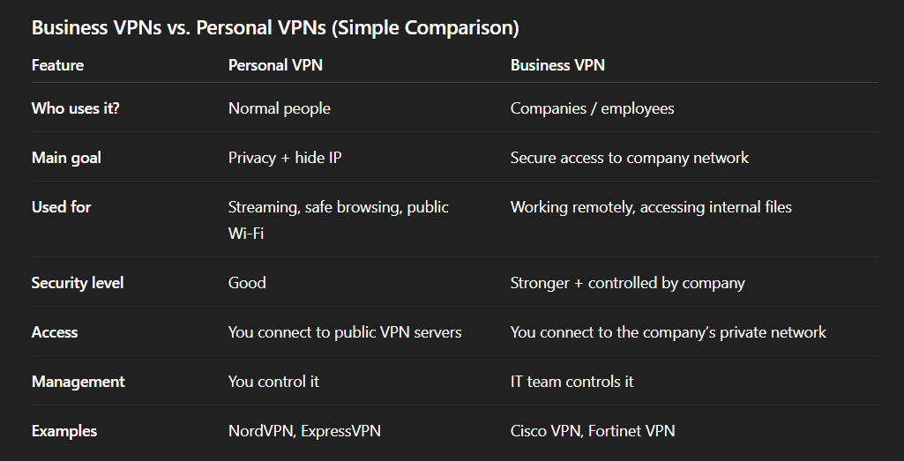

<link rel="stylesheet" href="https://cdnjs.cloudflare.com/ajax/libs/highlight.js/11.8.0/styles/monokai-sublime.min.css">

<link rel="icon" href="./favicon.ico" type="image/x-icon">

# Intro to VPNs

#### + other things you should know

---

# What is a VPN ?

--

# CHATGPT ASWER

--

A VPN is an obfuscated, cryptographically encapsulated, overlay networking construct predicated upon the establishment of a logically segregated, tunneled conduit across heterogeneous, adversarial packet-switched infrastructures, wherein endpoint-originated datagrams are subjected to multi-layer symmetric/asymmetric cipher transformations, key-exchange-mediated session initialization.

--

--

--

A VPN is like someone going out in public wearing a **mask**.

Normally, when you go outside, people can recognize you, see your face, and know who you are.

But with a VPN:

- You are still going to the same places (websites)
- But you are wearing a **mask**
- So people watching can’t tell who you are or where you came from

So the internet still works the same, but you are **hidden behind the mask** .

---

# Why we need a VPN ?

--

- ☕ **Café Wi-Fi:** Using free Wi-Fi in a café becomes safer because my data is protected and others on the same network can’t easily see what I’m doing.

--

- 📺 **Blocked video:** Content that is not available in my country can still be accessed by connecting through another country.

--

- 👀 **Private browsing:** My online activity becomes harder to track by websites, ads, or even my internet provider.

--

- 🏠 **Work from home:** I can securely connect to my company’s systems without exposing sensitive work data to the internet.

--

---

--

https://www.zdf.de/serien/iris-die-wahrheit-100

--

---

# Types of VPNs

--

Business VPNs vs. personal VPNs

--

---

--

https://app.hackthebox.com/machines

--

---

# QUIZ TIME
